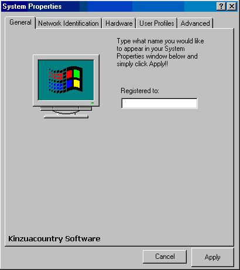



## System Name Editor

### Description

My program allows you to easily change your name that appears in the System Properties dialog window that is located in the Control Panel. I bascially made it so that people wouldnt have to navigate to the regedit and change it manually. Just a quick little app that allows people to edit their name! easy as 1 - 2 - 3
 
### More Info
 

             |
---                |---
**Submitted On**   |2004-01-14 20:41:18
**By**             |[Syphor Cod3r](https://github.com/Planet-Source-Code/PSCIndex/blob/master/ByAuthor/syphor-cod3r.md)
**Level**          |Beginner
**User Rating**    |3.8 (15 globes from 4 users)
**Compatibility**  |VB 6\.0
**Category**       |[Registry](https://github.com/Planet-Source-Code/PSCIndex/blob/master/ByCategory/registry__1-36.md)
**World**          |[Visual Basic](https://github.com/Planet-Source-Code/PSCIndex/blob/master/ByWorld/visual-basic.md)
**Archive File**   |[System\_Nam1694361142004\.zip](https://github.com/Planet-Source-Code/syphor-cod3r-system-name-editor__1-51005/archive/master.zip)

